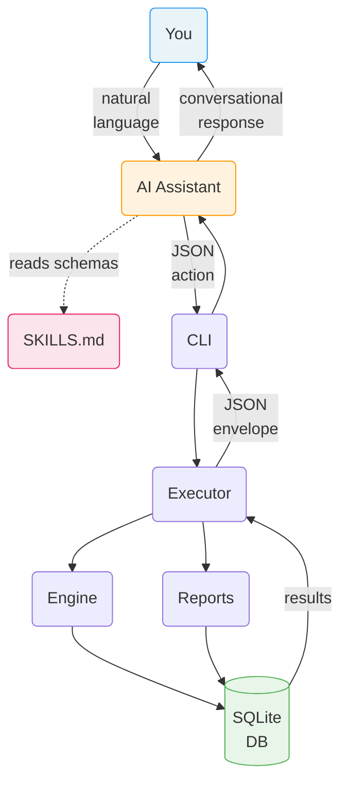

# habit-sprint

A deterministic, JSON-native sprint-based habit tracking engine designed for LLM-first workflows and agent integration.

## Why habit-sprint?

Most habit trackers are standalone apps with rigid UIs. Habit Sprint takes a fundamentally different approach: **the AI is the interface.**

By exposing a structured JSON engine as an LLM skill, your AI assistant — whether it's [Claude Code](https://docs.anthropic.com/en/docs/claude-code), [OpenClaw](https://github.com/AgenTool-AI/openclaw), or another agent — gains deep, personalized knowledge of your habits, goals, and behavioral patterns. This unlocks interactions that no traditional app can offer:

- **Conversational tracking** — Say "I meditated and exercised today" instead of tapping checkboxes. Your assistant translates natural language into precise state updates.
- **Personalized coaching** — Your assistant sees your streaks, completion rates, and trends. It can notice you've missed the gym three days in a row and proactively ask about it.
- **Proactive nudges and reminders** — A personal assistant like OpenClaw can check your progress throughout the day and prompt you: "You haven't logged reading yet — still time before bed."
- **Contextual reflection** — At the end of a sprint, your assistant walks you through a retrospective informed by your actual data, not vague recollections.
- **Cross-domain awareness** — Because your assistant already knows your calendar, tasks, and goals, it can connect the dots: "You've been crushing your deep work habit on days you exercise in the morning."

The engine handles all the computation — streaks, scores, completion percentages, weekly breakdowns. Your AI assistant handles the conversation. Neither guesses at the other's job.

## Quick Examples

Once the skill is installed, you interact through natural language. The assistant calls the engine under the hood.

### Set up a sprint

> **You:** Create a 2-week sprint starting today with the theme "Deep Focus" and goals: read daily, exercise 4x/week, meditate every morning.
>
> **Assistant:** Created sprint 2026-S03 (Mar 1 – Mar 14) with theme "Deep Focus" and 3 focus goals. Want me to set up the habits too?

### Log your day

> **You:** I meditated this morning, did 45 minutes of deep work, and went to the gym.
>
> **Assistant:** Logged 3 entries for today. Your daily score is 8/11 (73%). You're on a 4-day meditation streak.

### Check your progress

> **You:** How am I doing this week?

The assistant calls `sprint_dashboard` and renders:

```
====================================================================
SPRINT: 2026-03-02 → 2026-03-15  [Week 1 of 2]
THEME:  Build Morning Routine
FOCUS:  Wake by 6am | Read daily | Exercise 4x/week
====================================================================

CATEGORY: Health                                         Score: 100%
--------------------------------------------------------------------
Habit                     | Min/Wk | Wt | Mon Tue Wed Thu Fri Sat Sun |
--------------------------------------------------------------------
Exercise                  |   4    | 3  |   ✓   ✓   ·   ✓   ·   ✓   · |  4/4  100% ★
--------------------------------------------------------------------

CATEGORY: Mindfulness                                    Score: 100%
--------------------------------------------------------------------
Habit                     | Min/Wk | Wt | Mon Tue Wed Thu Fri Sat Sun |
--------------------------------------------------------------------
Meditation                |   7    | 2  |   ✓   ✓   ✓   ✓   ✓   ✓   ✓ |  7/7  100% ★
Journaling                |   5    | 1  |   ✓   ·   ✓   ✓   ✓   ·   ✓ |  5/5  100% ★
--------------------------------------------------------------------

====================================================================
DAILY TOTALS                    Mon  Tue  Wed  Thu  Fri  Sat  Sun
Points                    →      8    7    5    6    5    7    3
Max Possible              →      8    8    8    8    8    8    8
Completion %              →   100%  88%  62%  75%  62%  88%  38%
====================================================================

SPRINT SUMMARY                                        Weighted: 100%
--------------------------------------------------------------------
Exercise               4 / 4  → 100% ★
Meditation             7 / 7  → 100% ★
Journaling             5 / 5  → 100% ★
--------------------------------------------------------------------
```

### Get nudged by your assistant

> **OpenClaw (proactive):** Hey — it's 8pm and you haven't logged reading today. You're 1 day short of your weekly target. Still planning to read tonight?

### End-of-sprint reflection

> **You:** Let's do a retro.
>
> **Assistant:** Here's your sprint summary: meditation hit 100%, exercise was 75% (dropped off week 2), reading held strong at 90%. What went well? What would you change?

## Architecture

The engine is a thin, deterministic state machine. The LLM never computes metrics — it reads structured results and presents them conversationally.



**Key design principles:**

- **LLM-first** — Natural language in, structured JSON operations out
- **Deterministic** — The engine owns all arithmetic. The LLM never computes scores or streaks.
- **JSON-contract driven** — Strict schemas for every action. No freeform input.
- **SQLite-backed** — Zero-infra, portable, inspectable persistence
- **22 actions** — Sprints, habits, entries, reporting, retrospectives

## Requirements

- Python 3.12+

## Installation

```bash
# Quick install
make install

# With dev dependencies (pytest)
make install-dev
```

Or manually:

```bash
python3 -m venv .venv
.venv/bin/pip install -e .
```

## LLM Skill Installation

Install the skill so your AI assistant can drive the engine directly:

```bash
# Claude Code
make claude-skill-install     # Install skill
make claude-skill-check       # Check status
make claude-skill-uninstall   # Remove skill

# OpenClaw
make openclaw-skill-install   # Install skill
make openclaw-skill-check     # Check status
make openclaw-skill-uninstall # Remove skill

# Custom OpenClaw skills directory
make openclaw-skill-install OPENCLAW_SKILLS_DIR=/path/to/skills
```

Once installed, the skill teaches the assistant all 22 actions, payload schemas, and constraints. See [SKILLS.md](SKILLS.md) for the full reference.

## CLI Usage

You can also interact directly via the JSON contract:

```bash
# List all sprints
habit-sprint --json '{"action": "list_sprints"}'

# Create a sprint
habit-sprint --json '{"action": "create_sprint", "payload": {"name": "March 2026", "start_date": "2026-03-01"}}'

# Log a habit entry
habit-sprint --json '{"action": "log_date", "payload": {"habit_id": "gym", "date": "2026-03-03", "value": 1}}'

# Sprint dashboard (markdown output)
habit-sprint --json '{"action": "sprint_dashboard"}' --format markdown

# Use a custom database
habit-sprint --db /path/to/my.db --json '{"action": "list_sprints"}'
```

All responses use a standard envelope:

```json
{"status": "success", "data": {...}, "error": null}
```

## Actions

| Category | Actions |
|----------|---------|
| **Sprints** | `create_sprint`, `update_sprint`, `list_sprints`, `archive_sprint`, `get_active_sprint` |
| **Habits** | `create_habit`, `update_habit`, `archive_habit`, `list_habits` |
| **Entries** | `log_date`, `log_range`, `bulk_set`, `delete_entry` |
| **Retrospectives** | `add_retro`, `get_retro` |
| **Reporting** | `weekly_completion`, `daily_score`, `get_week_view`, `sprint_report`, `habit_report`, `category_report`, `sprint_dashboard` |

See [SKILLS.md](SKILLS.md) for full action schemas and [COOKBOOK.md](COOKBOOK.md) for practical usage patterns.

## Testing

```bash
make test
```

Runs 682 tests covering the engine, CLI, reporting, validation, and error handling.

## Project Structure

```
habit-sprint/
  habit_sprint/
    cli.py          # CLI adapter (JSON-in/JSON-out)
    db.py           # SQLite connection and migration runner
    engine.py       # Core business logic (sprints, habits, entries, retros)
    executor.py     # Action router and response envelope
    formatters.py   # Markdown output formatting
    reporting.py    # Queries (dashboards, reports, scores)
    validation.py   # Payload schema validation
  migrations/
    001_initial_schema.sql
  tests/            # 682 tests
  docs/
    prd.md          # Product requirements document
  SKILLS.md         # LLM skill reference (22 action schemas)
  COOKBOOK.md        # Practical usage guide with example prompts
  Makefile          # Build, test, and skill install targets
  pyproject.toml
```

## Make Targets

Run `make help` to see all available targets:

| Target | Description |
|--------|-------------|
| `make install` | Create venv and install in editable mode |
| `make install-dev` | Install with dev dependencies (pytest) |
| `make test` | Run pytest |
| `make run` | Print CLI usage examples |
| `make clean` | Remove caches and build artifacts |
| `make clean-all` | Clean + remove virtual environment |
| `make help` | Show all available targets |

## Background

Habit Sprint started as a spreadsheet template in 2012 — a simple grid for tracking daily habits with color-coded cells. In 2020, the concept of the **habit sprint** was introduced: borrowing the two-week cadence from software development sprints and applying it to personal development. The idea was that two weeks is long enough to build momentum but short enough to course-correct — and ending each sprint with a retrospective creates a natural rhythm of self-reflection that most habit trackers lack entirely.

The core design principles from that original spreadsheet carried forward into this engine: minimum-days-per-week targets instead of all-or-nothing daily streaks, a weighted point system for behavioral leverage, category grouping, and built-in retrospectives as first-class citizens. What changed is the interface — instead of manually entering `1` into spreadsheet cells, the AI handles it through conversation.

## About

Created by [Eric Blue](https://about.ericblue.com)

Repository: [github.com/ericblue/habit-sprint](https://github.com/ericblue/habit-sprint)

## License

MIT
