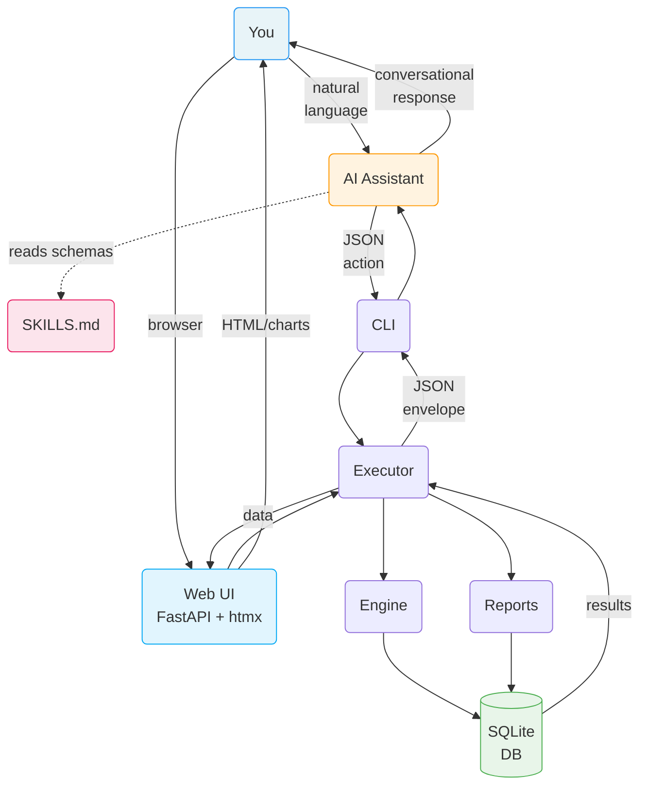
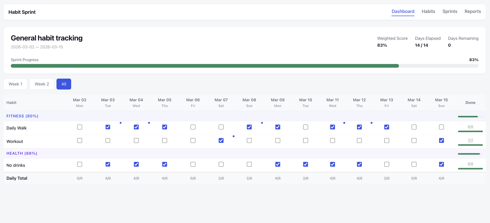
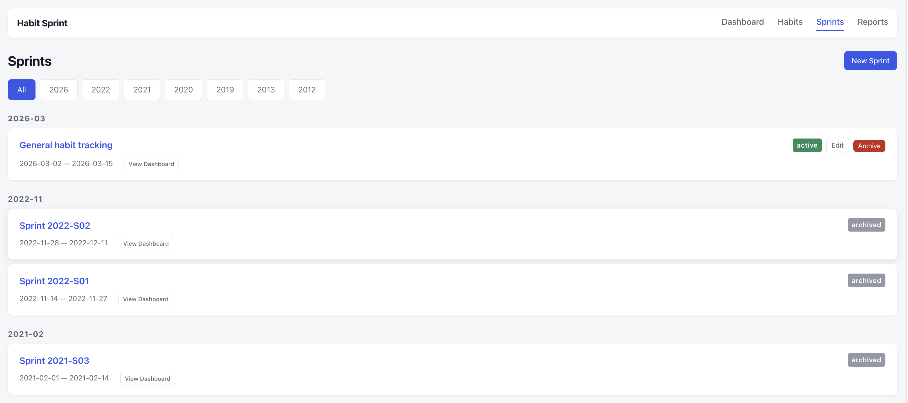
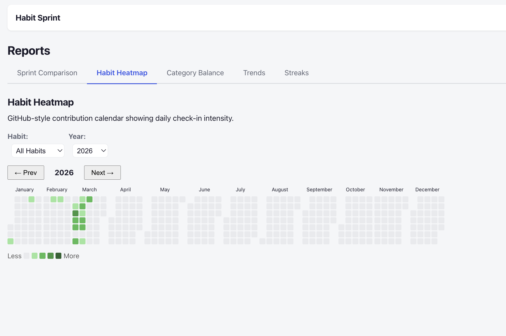
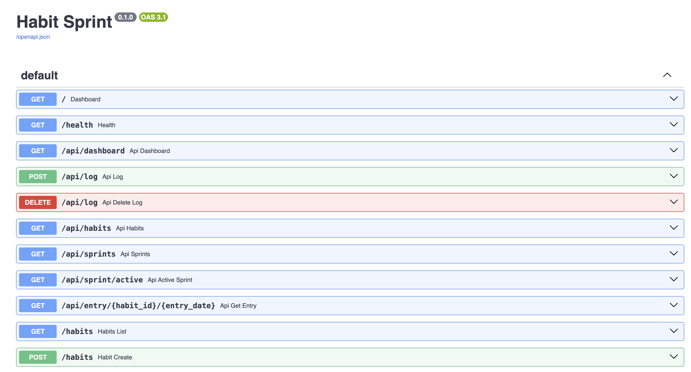
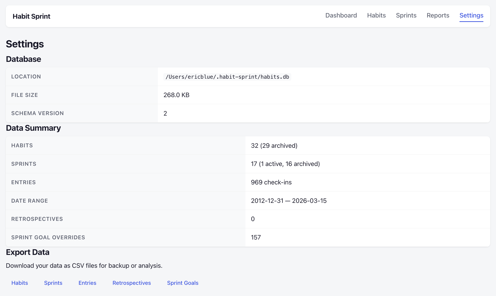

# habit-sprint

A deterministic, JSON-native sprint-based habit tracking engine with three interfaces: an **LLM-first conversational workflow** (CLI skill) for AI assistants, a **REST API** that powers the web layer, and a **lightweight web dashboard** for visual tracking and reports.

## Why habit-sprint?

Most habit trackers are standalone apps with rigid UIs. Habit Sprint takes a different approach: it's a structured engine that serves **two complementary interfaces**.

### AI as the interface

By exposing a structured JSON engine as an LLM skill, your AI assistant — whether it's [Claude Code](https://docs.anthropic.com/en/docs/claude-code), [OpenClaw](https://github.com/AgenTool-AI/openclaw), or another agent — gains deep, personalized knowledge of your habits, goals, and behavioral patterns. This unlocks interactions that no traditional app can offer:

- **Conversational tracking** — Say "I meditated and exercised today" instead of tapping checkboxes. Your assistant translates natural language into precise state updates.
- **Personalized coaching** — Your assistant sees your streaks, completion rates, and trends. It can notice you've missed the gym three days in a row and proactively ask about it.
- **Proactive nudges and reminders** — A personal assistant like OpenClaw can check your progress throughout the day and prompt you: "You haven't logged reading yet — still time before bed."
- **Contextual reflection** — At the end of a sprint, your assistant walks you through a retrospective informed by your actual data, not vague recollections.
- **Cross-domain awareness** — Because your assistant already knows your calendar, tasks, and goals, it can connect the dots: "You've been crushing your deep work habit on days you exercise in the morning."

### Web dashboard

A lightweight web UI built with FastAPI, htmx, and Jinja2 provides visual tracking and rich reports — no JavaScript framework required:

- **Sprint dashboard** — Interactive habit grid with one-click toggle, daily scores, and weekly progress
- **Habit management** — Create, edit, archive, and delete habits with category grouping
- **Sprint management** — Create sprints, set per-sprint goal overrides, manage habit assignments, and write retrospectives
- **Reports** — Sprint comparison charts, habit consistency heatmaps, streak leaderboards, category balance, and trend analysis — all powered by Chart.js and cal-heatmap

The engine handles all the computation — streaks, scores, completion percentages, weekly breakdowns. Your AI assistant handles the conversation. The web UI handles the visuals. Neither guesses at the other's job.

## Quick Examples

Once the skill is installed, you interact through natural language. The assistant calls the engine under the hood.

### Set up a sprint

> **You:** Create a 2-week sprint starting today with the theme "Deep Focus" and goals: read daily, exercise 4x/week, meditate every morning.
>
> **Assistant:** Created sprint 2026-S03 (Mar 1 – Mar 14) with theme "Deep Focus" and 3 focus goals. Want me to set up the habits too?

### Log your day

> **You:** I meditated this morning, did 45 minutes of deep work, and went to the gym.
>
> **Assistant:** Logged 3 entries for today. Your daily score is 8/11 (73%). You're on a 4-day meditation streak.

### Check your progress

> **You:** How am I doing this week?

The assistant calls `sprint_dashboard` and renders:

```
====================================================================
SPRINT: 2026-03-02 → 2026-03-15  [Week 1 of 2]
THEME:  Build Morning Routine
FOCUS:  Wake by 6am | Read daily | Exercise 4x/week
====================================================================

CATEGORY: Health                                         Score: 100%
--------------------------------------------------------------------
Habit                     | Min/Wk | Wt | Mon Tue Wed Thu Fri Sat Sun |
--------------------------------------------------------------------
Exercise                  |   4    | 3  |   ✓   ✓   ·   ✓   ·   ✓   · |  4/4  100% ★
--------------------------------------------------------------------

CATEGORY: Mindfulness                                    Score: 100%
--------------------------------------------------------------------
Habit                     | Min/Wk | Wt | Mon Tue Wed Thu Fri Sat Sun |
--------------------------------------------------------------------
Meditation                |   7    | 2  |   ✓   ✓   ✓   ✓   ✓   ✓   ✓ |  7/7  100% ★
Journaling                |   5    | 1  |   ✓   ·   ✓   ✓   ✓   ·   ✓ |  5/5  100% ★
--------------------------------------------------------------------

====================================================================
DAILY TOTALS                    Mon  Tue  Wed  Thu  Fri  Sat  Sun
Points                    →      8    7    5    6    5    7    3
Max Possible              →      8    8    8    8    8    8    8
Completion %              →   100%  88%  62%  75%  62%  88%  38%
====================================================================

SPRINT SUMMARY                                        Weighted: 100%
--------------------------------------------------------------------
Exercise               4 / 4  → 100% ★
Meditation             7 / 7  → 100% ★
Journaling             5 / 5  → 100% ★
--------------------------------------------------------------------
```

### Get nudged by your assistant

> **OpenClaw (proactive):** Hey — it's 8pm and you haven't logged reading today. You're 1 day short of your weekly target. Still planning to read tonight?

### End-of-sprint reflection

> **You:** Let's do a retro.
>
> **Assistant:** Here's your sprint summary: meditation hit 100%, exercise was 75% (dropped off week 2), reading held strong at 90%. What went well? What would you change?

## Architecture

The engine is a thin, deterministic state machine. The LLM never computes metrics — it reads structured results and presents them conversationally. The web UI consumes the same engine through FastAPI routes.



**Key design principles:**

- **Three interfaces** — LLM-first conversational workflow (CLI), REST API (FastAPI), and web dashboard all share the same engine
- **Deterministic** — The engine owns all arithmetic. The LLM never computes scores or streaks.
- **JSON-contract driven** — Strict schemas for every action. No freeform input.
- **SQLite-backed** — Zero-infra, portable, inspectable persistence
- **27 actions** — Sprints, habits, entries, reporting, retrospectives, per-sprint goals, streaks

## Web Interface

The web UI is a lightweight FastAPI application using htmx for interactivity and Jinja2 templates. No JavaScript framework — just server-rendered HTML with progressive enhancement.

### Dashboard

The main dashboard shows the active sprint's habit grid. Click any cell to toggle a habit entry. Daily scores and weekly completion percentages update in real-time via htmx. Notes can be added to individual entries.

### Habits

Browse all habits with category grouping. Create new habits with name, category, weekly target, weight, and unit. View individual habit detail pages showing streak history, completion trends, and entry logs. Archive or permanently delete habits you no longer need.

### Sprints

View all sprints grouped by year and month. Create new sprints with name, start date, duration, theme, and focus goals. Each sprint detail page shows the habit grid, retrospective, and per-sprint goal overrides. Manage which habits are assigned to a sprint and customize targets/weights per sprint without affecting the global defaults.

### Reports

A multi-tab reports page with interactive charts:

- **Sprint Comparison** — Bar chart comparing weighted scores across sprints (Chart.js)
- **Habit Heatmap** — GitHub-style consistency heatmap for any habit or all habits aggregated (cal-heatmap)
- **Category Balance** — Category-level score comparison across sprints
- **Trends** — Weekly completion percentage trends over time
- **Streak Leaderboard** — Table ranking habits by current and longest streaks

## Requirements

- Python 3.12+
- Optional web dependencies: FastAPI, uvicorn, Jinja2, python-multipart, httpx

## Quick Start

### LLM Skill (AI assistant)

If you want your AI assistant (Claude Code, OpenClaw, etc.) to manage your habits through natural language:

```bash
git clone https://github.com/ericblue/habit-sprint.git
cd habit-sprint
make install-global           # Install CLI on your PATH
make claude-skill-install     # Install the LLM skill (or openclaw-skill-install)
```

Start a new Claude Code session and ask about your habits. The database is created automatically at `~/.habit-sprint/habits.db`.

### Web UI

To launch the web dashboard:

```bash
make install-web              # Install with web dependencies (FastAPI, uvicorn, etc.)
habit-sprint serve            # Start web server on http://localhost:8000
```

Or with a custom port:

```bash
habit-sprint serve --port 9000
# or: make serve PORT=9000
```

The web UI and CLI share the same SQLite database (`~/.habit-sprint/habits.db`), so changes made through the assistant or CLI are immediately visible in the browser and vice versa.

## Installation

```bash
# Global install — puts habit-sprint on your PATH (recommended for LLM skill usage)
make install-global

# With web dependencies (FastAPI, uvicorn, Jinja2)
make install-web

# Local venv install — for development, puts binary at .venv/bin/habit-sprint
make install

# With dev dependencies (pytest)
make install-dev
```

Or manually:

```bash
# Global
pip install -e .

# With web extras
pip install -e ".[web]"

# Local venv
python3 -m venv .venv
.venv/bin/pip install -e ".[web]"
```

## LLM Skill Installation

The skill teaches your AI assistant all 27 actions, payload schemas, and constraints. It requires the `habit-sprint` CLI to be on your PATH (`make install-global`).

```bash
# Claude Code
make claude-skill-install     # Install skill
make claude-skill-check       # Check status
make claude-skill-uninstall   # Remove skill

# OpenClaw
make openclaw-skill-install   # Install skill
make openclaw-skill-check     # Check status
make openclaw-skill-uninstall # Remove skill

# Custom OpenClaw skills directory
make openclaw-skill-install OPENCLAW_SKILLS_DIR=/path/to/skills
```

See [SKILLS.md](SKILLS.md) for the full skill reference.

## CLI Usage

You can also interact directly via the JSON contract:

```bash
# List all sprints
habit-sprint --json '{"action": "list_sprints"}'

# Create a sprint
habit-sprint --json '{"action": "create_sprint", "payload": {"name": "March 2026", "start_date": "2026-03-01"}}'

# Log a habit entry
habit-sprint --json '{"action": "log_date", "payload": {"habit_id": "gym", "date": "2026-03-03", "value": 1}}'

# Sprint dashboard (markdown output)
habit-sprint --json '{"action": "sprint_dashboard"}' --format markdown

# Streak leaderboard
habit-sprint --json '{"action": "streak_leaderboard"}'

# Progress summary
habit-sprint --json '{"action": "progress_summary"}'

# Cross-sprint comparison
habit-sprint --json '{"action": "cross_sprint_report"}'

# Use a custom database
habit-sprint --db /path/to/my.db --json '{"action": "list_sprints"}'
```

All responses use a standard envelope:

```json
{"status": "success", "data": {...}, "error": null}
```

## Actions

| Category | Actions |
|----------|---------|
| **Sprints** | `create_sprint`, `update_sprint`, `list_sprints`, `archive_sprint`, `get_active_sprint` |
| **Habits** | `create_habit`, `update_habit`, `archive_habit`, `unarchive_habit`, `delete_habit`, `list_habits` |
| **Entries** | `log_date`, `log_range`, `bulk_set`, `delete_entry` |
| **Per-Sprint Goals** | `set_sprint_habit_goal`, `get_sprint_habit_goal`, `delete_sprint_habit_goal` |
| **Retrospectives** | `add_retro`, `get_retro` |
| **Reporting** | `weekly_completion`, `daily_score`, `get_week_view`, `sprint_report`, `habit_report`, `category_report`, `sprint_dashboard`, `cross_sprint_report`, `streak_leaderboard`, `progress_summary` |

See [SKILLS.md](SKILLS.md) for full action schemas and [COOKBOOK.md](COOKBOOK.md) for practical usage patterns.

## Screenshots

### Sprint Dashboard

Interactive habit grid with one-click toggles, daily scores, and weekly completion tracking.



### Sprints

View all sprints grouped by year and month, with status badges and quick actions.



### Reports — Habit Heatmap

GitHub-style consistency heatmap showing daily check-in intensity with habit filtering and year navigation.



### API (Swagger)

The REST API (FastAPI) backs the web interface and is browsable via the built-in Swagger docs at `/docs`.



### Settings

Database info, data summary, CSV export, and project details.



## Testing

```bash
make test
```

Runs 889 tests covering the engine, CLI, web routes, reporting, validation, and error handling.

## Project Structure

```
habit-sprint/
  habit_sprint/
    cli.py          # CLI adapter (JSON-in/JSON-out, --web/serve subcommand)
    db.py           # SQLite connection and migration runner
    engine.py       # Core business logic (sprints, habits, entries, retros)
    executor.py     # Action router and response envelope (27 actions)
    formatters.py   # Markdown output formatting
    reporting.py    # Queries (dashboards, reports, scores, streaks)
    validation.py   # Payload schema validation
    web.py          # FastAPI web application (htmx + Jinja2)
    templates/      # Jinja2 HTML templates (10 templates)
    static/
      style.css     # Responsive CSS with dark mode support
  migrations/
    001_initial_schema.sql
    002_sprint_habit_goals.sql
  tests/            # 889 tests
  docs/
    prd.md          # Product requirements document
    screenshots/    # Web UI screenshots
  SKILLS.md         # LLM skill reference (27 action schemas)
  COOKBOOK.md        # Practical usage guide with example prompts
  Makefile          # Build, test, serve, and skill install targets
  pyproject.toml
```

## Make Targets

Run `make help` to see all available targets:

| Target | Description |
|--------|-------------|
| `make install-global` | Install globally on PATH (recommended for LLM skill usage) |
| `make install` | Create venv and install in editable mode |
| `make install-dev` | Install with dev dependencies (pytest) |
| `make install-web` | Install with web dependencies (FastAPI, uvicorn, Jinja2) |
| `make test` | Run pytest |
| `make serve` | Start web UI (default port 8000) |
| `make run` | Print CLI usage examples |
| `make clean` | Remove caches and build artifacts |
| `make clean-all` | Clean + remove virtual environment |
| `make help` | Show all available targets |

## Background

Habit Sprint started as a spreadsheet template in 2012 — a simple grid for tracking daily habits with color-coded cells. In 2020, the concept of the **habit sprint** was introduced: borrowing the two-week cadence from software development sprints and applying it to personal development. The idea was that two weeks is long enough to build momentum but short enough to course-correct — and ending each sprint with a retrospective creates a natural rhythm of self-reflection that most habit trackers lack entirely.

The core design principles from that original spreadsheet carried forward into this engine: minimum-days-per-week targets instead of all-or-nothing daily streaks, a weighted point system for behavioral leverage, category grouping, and built-in retrospectives as first-class citizens. What changed is the interface — instead of manually entering `1` into spreadsheet cells, you can track habits through conversation with an AI assistant or through a clean web dashboard.

## Version History

| Version   | Date       | Description     |
| --------- | ---------- | --------------- |
| **0.2.1** | 2026-03-16 | Bug fixes and sprint unarchive |
| **0.2.0** | 2026-03-15 | Web UI, reports, and analytics |
| **0.1.0** | 2026-03-01 | Initial release |

### v0.2.1 — Bug Fixes & Sprint Unarchive

- Fix archived sprint scores changing from active values — archived habits with stale `sprint_habit_goals` entries were being included in score calculations
- Snapshot global habits into `sprint_habit_goals` on archive so the habit set is preserved
- Add sprint unarchive/restore functionality (engine, API, and web UI)
- Add `make release V=x.y.z` target for automated versioning, tagging, and push
- Add `/release` slash command for Claude Code
- 28 JSON actions (up from 27)
- 896 tests (up from 889)

### v0.2.0 — Web UI, Reports & Analytics

- Lightweight web dashboard (FastAPI + htmx + Jinja2)
- Interactive sprint dashboard with one-click habit toggles
- Habit management: create, edit, archive, unarchive, delete
- Sprint management with per-sprint goal overrides (`sprint_habit_goals`)
- Sprint comparison report with bar charts (Chart.js)
- Habit consistency heatmap (cal-heatmap)
- Streak leaderboard and progress summary actions
- Category balance and trend charts
- Year/month sprint grouping in sprint list
- Entry notes support
- 27 JSON actions (up from 22)
- 889 tests (up from 682)

### v0.1.0 — Initial Release

- Sprint-based habit tracking with two-week cycles
- 22 JSON actions: sprints, habits, entries, reporting, retrospectives
- Weighted scoring system with category grouping
- Global and sprint-scoped habits
- Markdown dashboard rendering
- LLM skill integration (Claude Code, OpenClaw)
- CLI with JSON-in/JSON-out contract
- SQLite persistence with automatic migrations
- 682 tests

## About

Created by [Eric Blue](https://about.ericblue.com)

Repository: [github.com/ericblue/habit-sprint](https://github.com/ericblue/habit-sprint)

## License

MIT
